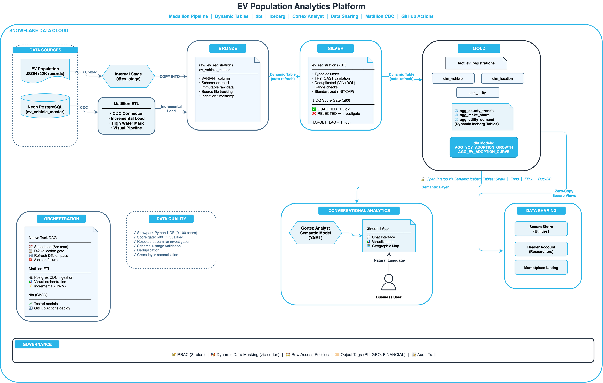

# EV Population Analytics Platform — Snowflake

## Overview
End-to-end data engineering solution on Snowflake using the Electric Vehicle Population Dataset (22,183 registrations from Washington State). Demonstrates medallion architecture, orchestration, open table formats, data sharing, Matillion ETL for CDC ingestion, and conversational analytics powered by Cortex Analyst.

## Project Structure

```
├── src/
│   ├── bronze/              # Raw data ingestion (Stage, COPY INTO, VARIANT)
│   ├── silver/              # Cleanse, validate, deduplicate (Dynamic Table)
│   ├── gold/                # Facts, dimensions, aggregates (Dynamic Iceberg), sharing
│   ├── audit/               # Observability: DQ UDF, pipeline audit, Task DAG, reconciliation
│   └── admin/               # Governance: RBAC, masking policies, object tags
├── dbt/                     # dbt models (YoY adoption growth, adoption curve) + tests
├── streamlit/               # Streamlit app + Cortex Analyst semantic model
├── .matillion/              # Matillion ETL pipeline config (Postgres CDC)
├── .github/workflows/       # CI/CD (GitHub Actions → Snowflake deploy)
└── docs/                    # Architecture document + diagram
```

## Architecture



| Layer | Purpose | Snowflake Features |
|-------|---------|-------------------|
| **Bronze** | Raw ingestion, schema-on-read | Internal Stage, COPY INTO, VARIANT |
| **Bronze (CDC)** | Incremental ingestion from Postgres | Matillion ETL, High Water Mark, CDC Connector |
| **Silver** | Cleanse, validate, deduplicate | Dynamic Table, Snowpark Python UDF |
| **Gold** | Business aggregates, facts, dimensions | Dynamic Iceberg Tables, dbt, Secure Views |
| **Analytics** | Conversational natural language queries | Cortex Analyst + Streamlit |
| **Sharing** | Zero-copy governed data sharing | Secure Share + Reader Account |
| **Governance** | Access control + classification | RBAC, Dynamic Masking, Object Tags |

## Key Design Decisions

| Decision | Choice | Rationale |
|----------|--------|-----------|
| Architecture pattern | Medallion (Bronze/Silver/Gold) | Auditability, reprocessability, separation of concerns |
| Transformation engine | Dynamic Tables + dbt (hybrid) | DTs for declarative auto-refresh; dbt for testable, version-controlled models |
| Open table format | Dynamic Iceberg Tables in Gold | Auto-refresh + multi-engine interop (Spark/Trino/Flink), no lock-in |
| Data quality | Snowpark Python UDF + SQL assertions | Right-sized for scope; at scale would add Soda/Monte Carlo |
| Orchestration | Task DAG + Matillion ETL + dbt CI/CD | Native Tasks for scheduling; Matillion for visual CDC; dbt for tested transforms |
| CDC Ingestion | Matillion ETL (Postgres → Snowflake) | Connector-based, incremental (HWM), no custom code, visual pipeline |
| NL Analytics | Cortex Analyst REST API | Semantic model → SQL generation → governed query execution |
| Sharing | Secure Share + Secure Views | Zero-copy, instant, governed by provider |

## Dataset

**Source:** Washington State Department of Licensing  
**Records:** 22,183 EV registrations  
**Fields:** VIN, County, City, State, Zip, Model Year, Make, Model, EV Type (BEV/PHEV), CAFV Eligibility, Electric Range, Base MSRP, Legislative District, State Agency Vehicle ID, Lat/Long, Electric Utility, Census Tract

## Running the Pipeline

**Initial setup (from scratch):** Execute SQL scripts in order:
```
src/bronze/01_setup.sql → 02_stage_and_load.sql
src/silver/01_dynamic_table.sql
src/gold/01_dimensions.sql → 02_fact.sql → 03_aggregates.sql → 05_sharing.sql
src/audit/01_audit_dq_orchestration.sql
src/admin/01_rbac_tags_masking.sql
```

**Ongoing operation:** Fully automated — no manual intervention needed:
- Task DAG runs every 6 hours (DQ validation → refresh → metrics logging)
- Dynamic Tables auto-refresh within 1-hour TARGET_LAG
- GitHub Actions auto-deploys code changes on merge to main

## Streamlit App

The Streamlit app provides:
- **Cortex Analyst chat** — natural language → SQL → results
- **Executive dashboard** — KPIs, market share, BEV/PHEV split
- **Regional analysis** — county-level adoption breakdown
- **Adoption trends** — YoY growth, range improvement, new manufacturers

## Documentation

- [`docs/ARCHITECTURE.md`](docs/ARCHITECTURE.md) — Full architecture document with trade-off analysis
- [`dbt/README.md`](dbt/README.md) — dbt vs Dynamic Tables design decision
- [`.github/workflows/deploy.yml`](.github/workflows/deploy.yml) — CI/CD pipeline (auto-deploys SQL, dbt, Streamlit on merge)
